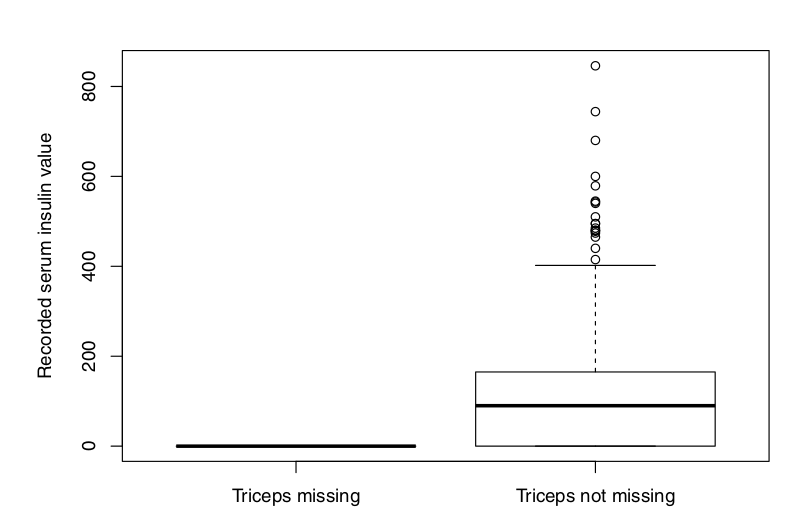

### Análisis de datos exploratorios: una primera mirada
### Cuatro conceptos clave en la exploración de datos
    
    revelación
    derechos residuales de autor
    reexpresión
    resistencia.

#### Explorando un nuevo conjunto de datos
#### Estrategia general para el analisis de datos

        1. Evaluar las características generales del conjunto de datos, por ejemplo:
              a. ¿Cuántos registros tenemos? ¿Cuantas variables
              
              b ¿Cuáles son los nombres de las variables? ¿Son significativos?
              
              C. ¿De qué tipo es cada variable, por ejemplo, numérica, categórica, lógica?
              
              d ¿Cuántos valores únicos tiene cada variable?
              
              e ¿Qué valor ocurre con mayor frecuencia y con qué frecuencia ocurre?
              
              F. ¿Faltan observaciones? Si es así, ¿con qué frecuencia ocurre esto?
              
      2. Examine las estadísticas descriptivas para cada variable.
      
      3. Donde sea posible, ciertamente para cualquier variable de interés particular, examine las visualizaciones exploratorias
      
      4. Nuevamente, cuando sea posible, aplique los procedimientos  para buscar anomalías en los datos;
      
      5. Observe las relaciones entre variables clave;
      
      6. Finalmente, resuma estos resultados en forma de un diccionario de datos, para que sirva de base para el análisis posterior y la explicación de los resultados.
      
### Examinar las características básicas de los datos.

La funcion BasicSummary genera todas las características de datos enumeradas en el Paso (1) , excepto los números de registros y variables. 

### Tipos de Variables
Al igual que la mayoría de las otras plataformas de análisis de datos, R admite un conjunto de tipos de variables predefinidos, incluidos los numéricos, de caracteres, lógicos y factores.
### Variables numéricas vs. ordinales vs. nominales
Una característica importante de los datos numéricos es que podemos aplicarle muchas operaciones matemáticas, calcular sumas, diferencias, productos, cocientes, promedios, raíces cuadradas y muchas otras combinaciones y / o transformaciones.   Sin embargo, no todas las variables son numéricas, y la mayoría de estas operaciones matemáticas no son aplicables a las variables no numéricas. 
Al trabajar con variables nominales, todo lo que podemos hacer es contar y comparar, haciendo preguntas como las siguientes, dada una variable categórica:
    
    ¿Cuántos valores distintos o "niveles" exhibe la variable?
      ¿Con qué frecuencia se produce cada uno de estos niveles en el conjunto de datos?
    ¿Cómo varía el comportamiento de otra variable X sobre los niveles de C?
    
Estas preguntas forman la base para las caracterizaciones de variables categóricas
Otra clase de variables que es en muchos aspectos intermedia entre las variables numéricas y nominales es la clase de variables ordinales, también denominadas variables categóricas ordenadas o factores ordenados. Estas variables asumen valores no numéricos, por lo que el rango completo de operaciones matemáticas no está disponible para nosotros al trabajar con ellas, pero poseen un orden inherente, por lo que podemos decir que un valor de la variable es "menor que" o "precede ”Otro valor. 
 Como ejemplo específico, la variable Make en el framework Cars93 del paquete MASS se incluye como una variable de factor, pero se puede convertir a un vector de caracteres de longitud 93, a partir del cual la mediana se puede calcular como:
```{r}
 library(MASS)
median(as.character(Cars93$Make))
table(Cars93$Cylinder)
```

### Text data vs. character strings
 Las variables categóricas, ya sean nominales u ordinales, se representan comúnmente como cadenas de caracteres.  Se han desarrollado técnicas especializadas para abordar los problemas críticos que surgen al hacer el análisis de texto pero que no son necesarios para tratar con variables categóricas más simples. Por ejemplo, las frases "Material de alta resistencia" y "Fuerza de material: alta" transmiten el mismo significado, pero son distintas como cadenas de caracteres, que difieren en mayúsculas, puntuación y orden de las palabras. 
 
 ### Anomalías en datos numéricos.
 
 ### Los valores atípicos y su influencia
 Un outlier(valor atipico) es una observación (o subconjunto de observaciones) que parece ser inconsistente con el resto de ese conjunto de datos.
 
 Estos puntos se encuentran bastante fuera del rango observado para los otros cereales, que varían de 0 a aproximadamente 12, por lo que estos tres cereales cumplen con los criterios definitorios para valores atípicos ofrecidos por Barnett y Lewis citados anteriormente. 
 ```{r}
 outlierIndex <- which(UScereal$fibre > 25)
rownames(UScereal)[outlierIndex]
  ```
  
### Detectar valores atípicos univariantes 
  El término detección de valores atípicos univariantes se refiere al proceso de identificación de valores atípicos en una sola variable. En este caso, "inconsistente con el resto de los datos" generalmente se interpreta como "inusualmente muy por encima o por debajo de los valores de datos 'típicos'". 

### The three-sigma edit rule
  La base es la observación de que, para datos aproximadamente gaussianos, los puntos que se encuentran a más de tres desviaciones estándar de la media deberían ocurrir con una probabilidad menor a aproximadamente 0.3%, según los resultados de probabilidad de cola.

### Metodos de detección
  Algunos otros metodos para la detección de outliers:
                 
                     1.- Identificador Hampel
                     2.-The boxplot outlier rule
                
### Summary: some practical advice on outlier detection
Es importante tener en cuenta que, si bien la detección de valores atípicos se puede automatizar como un procedimiento matemático (la regla de edición de tres sigmas, el identificador de Hampel, d y la regla de diagrama de caja representan tres ejemplos específicos), la interpretación de los valores atípicos no se puede automatizar, ya que No es un problema matemático
  

### Inliers
El término inliers a veces se usa para referirse a los puntos "nominales" o "no periféricos" en una secuencia de datos. Un inlier es "un valor de datos que se encuentra en el interior de una distribución estadística y está en error". Una característica común de las inliers en los datos numéricos es que a menudo representan el mismo valor, que se repite con una frecuencia inusual.
           
### Ejemplo
El dataframe chile tiene 2700 registros y esta variable asume 2093 valores únicos. Usando la función  table para contar el número de veces que ocurre cada valor, obtenemos el siguiente rango de conteos:
 ```{r}
 library(carData)
Tbl <- table(Chile$statusquo, useNA = "ifany")
range(Tbl)
table(Tbl)
median(as.numeric(Tbl))
mad(as.numeric(Tbl))
quantile(Tbl)
  ```
  
  ### Errores de MetaData
  Los metadatos se refieren a "datos sobre datos". Idealmente, los metadatos incluyen definiciones detalladas de las variables, rangos de valores admisibles, número de observaciones faltantes y la notación utilizada para indicarlos, junto con cualquier otra característica o peculiaridad notable. El error en los metadatos pueden traer consecuencias catastroficas, como la falla de un satelite que pretendía el estudio de marte, por errores en los metadatos de las mediddas de medición, fallaron los calculos lo que ocasionarón que se estrellara contra la atmosfera, destruyendose en el acto, lo que fue una perdida de 115 millones de dolares para la NASA.
  
  
### Datos faltantes, posiblemente disfrazados
Un excelente ejemplo de datos faltantes disfrazados es el dataset de PimaIndiansDiabetesm donde los metadatos originalmente indicaban que no había valores faltantes, pero aparecen valores físicamente imposibles en ciertas variables (por ejemplo, presión arterial diastólica).

                    


### Datos sistemáticos faltantes
La falta de datos a menudo se supone que es un fenómeno aleatorio. Esta es una situación en la que podemos intentar detectar y desarrollar formas de direccionamiento, observando las distribuciones de registros faltantes en función de las otras variables en el conjunto de datos. Se presenta un boxplot que compara la distribución de los valores de insulina para registros con valores de tríceps faltantes (es decir, cero) y valores de tríceps no perdidos (es decir, no cero). Está claro en esta gráfica que falta el valor de insulina (es decir, registrado como cero) cada vez que falta el valor del tríceps; el grado en que los valores de insulina son cero cuando no falta el tríceps no está claro en esta gráfica.


. Para ilustrar, el siguiente ejemplo compara tres secuencias de datos: (1) una secuencia completamente observada de N = 200 muestras; (2) una variación donde el 25 de los valores de datos faltan completamente al azar; y (3) una segunda variación donde falta el 25 más grande de los valores de datos, lo que representa un escenario típico de MNAR. Aquí, la secuencia de datos completa es una secuencia de números aleatorios gaussianos de media unidad y varianza unitaria, y la media calculada y la desviación estándar son:
 ```{r}
 set.seed(333)
x <- sort(rnorm(200))
mean(x)
 sd(x)
   ```
#### Relación entre variables
   Probablemente la representación más conocida de la relación entre dos variables es el diagrama de dispersión.  Otras muestras útiles de dos variables son el plotbox y el beanplot, ambos describen la relación entre una variable categórica y una variable numérica y el diagrama de mosaico, que muestra la relación entre dos variables categóricas .
   

   
   #### Diagramas de dispersión entre variables numéricas
 Diagrama de dispersión del consumo de combustible de la ciudad (MPG.city) vs la potencia (Horsepower) del dataframe Cars93 en el paquete MASS, con dos mejoras. El primero es el tamaño de los puntos variables que dependen del valor de los cilindros, dando el número y / o tipo de cilindros en el diseño del automóvil. Los seis valores únicos de esta variable se pueden obtener como tabla (Cars93 $ Cylinders) Para usar estos niveles para controlar el tamaño de los puntos, se generó el diagrama de dispersión.
 ```{r}
plot(Cars93$Horsepower, Cars93$MPG.city,
xlab = "Horsepower", ylab = "City gas mileage",
pch = 18, cex = 0.6 * as.numeric(Cars93$Cylinders))
``` 


### Boxplots: numerical vs. variables categoricas
Diagrama de caja de ancho variable que muestra el rango de variación del consumo de combustible de la ciudad en todos los registros que enumeran cada uno de los seis valores posibles de los cilindros en el dataframe de Cars93. La opción varwidth = TRUE se ha utilizado aquí, lo que hace que el ancho de cada diagrama de caja individual dependa del número de registros en cada grupo.
 ```{r}
par(mfrow=c(1,1))
boxplot(MPG.city ~ Cylinders, data = Cars93,
xlab = "Cylinders", ylab = "MPG.city",
varwidth = TRUE)
``` 

 
   